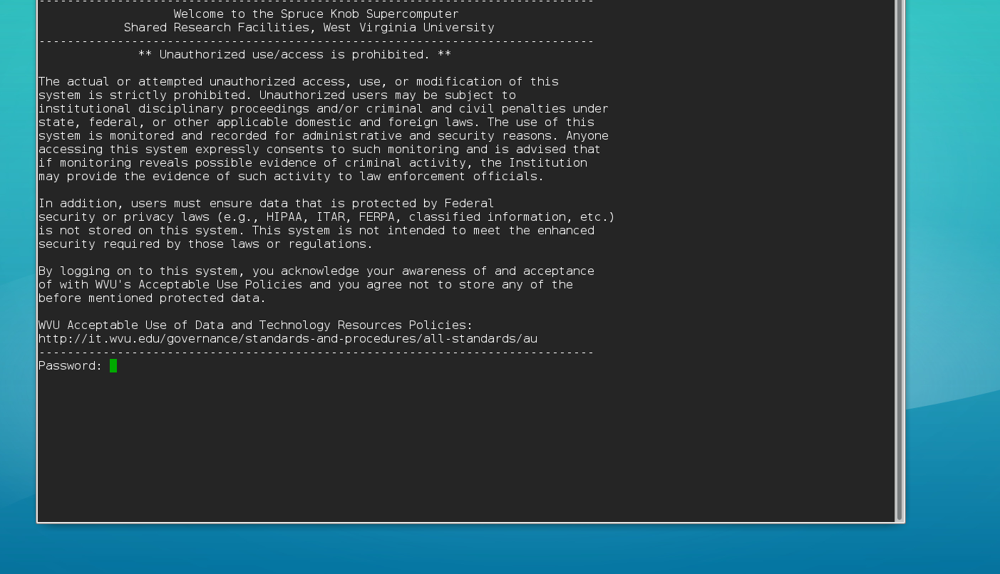

> ## Learning Objectives {.objectives}
>
> * Connect to a remote system using the <code>ssh</code> command

There are almost an infinite number of ways to interact with 
remote computers.  Everytime you recieve mail or visit a webpage, you interface 
with a remote server.  Depending on what service or information you are trying 
to achieve, you will use different tools.  When utilizing a remote system to do 
scientific computing, we want a login shell on the remote system.  Login shells 
are identical to the Unix shells you have used in the past, the only difference 
is when you type a command, that command is passed through a network connection 
to the other system, executed on that system, and the output is then passed to 
your local screen.  This type of connection is called a remote login, as 
opposed to a local login (i.e. when you login or boot up your personal 
computer).  The most common way to initiate a remote login is by using the 
`ssh` command, which utilizes the Secure Shell (SSH) protocol.

Before you connect to a remote system, you need to know two pieces of 
information: 1) the hostname of the remote system. 2) your username/password on 
the remote system.  The hostname is similar to a URL (www.google.com), in that 
it gives the network address of the remote system in human readable 
format.  The hostname of the system is usually on the internal documentation of 
the system, or may even be on a Wiki/webpage setup for end users of 
the system.  Or you might have gotten this information from the System 
adminstrators when they set-up your account.  Your username/password will be 
associated with the account setup for you.  **You must have an account on the 
system in order for the `ssh` command to grant you access to the remote 
system**.

Once you have the two pieces of information, you can initiate a login request 
using the ssh command.

~~~ {.bash}
$ ssh spruce.hpc.wvu.edu -l training01
~~~

> ## Username and Hostname Variation {.callout}
>
> In our example, we use the hostname 'spruce.hpc.wvu.edu' (Spruce Knob) and 
> the username 'training01'.  You might need to change these parts of the 
> command to match your hostname/username you are trying to connect to.

> ## Typed Password won't show {.callout}
>
> When typing into a password prompt, characters will not display on the 
> screen.  This is to prevent anybody from seeing you type in your password.  
> Hit enter once you have typed your full password in.

The previous `ssh` command directed the username with the '-l' option.  There 
are other ways to indicate the username to be used.  One way is to include the 
username in the hostname, separating the two with an '@' symbol - just like an 
email address.

~~~ {.bash}
$ ssh training01@spruce.hpc.wvu.edu
~~~

Once you are connected to a remote system, you will notice that you have a Unix 
shell that looks and works exactly the same as other Unix shells you have used 
in the past.  
